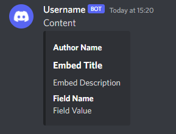

## discord-webhooks - Kotlin library for sending discord webhooks
[](https://github.com/BinaryWriter/discord-webhooks)
[](https://github.com/BinaryWriter/discord-webhooks/issues)
[](https://github.com/BinaryWriter/discord-webhooks/pulls)
[](https://jitpack.io/#BinaryWriter/discord-webhooks)

---
### Download

- #### Gradle
```groovy
    repositories {
        //...
        maven { url = 'https://jitpack.io' }
    }
    
    dependencies {
        //...
        implementation 'com.github.BinaryWriter:discord-webhooks:1.0'
    }
```

- #### Maven
```xml
    <project>
        <repositories>
            <!-- ... -->
            <repository>
                <id>jitpack-repo</id>
                <url>https://jitpack.io</url>
            </repository>
        </repositories>
    
        <dependencies>
            <!-- ... -->
            <dependency>
                <groupId>com.github.BinaryWriter</groupId>
                <artifactId>discord-webhooks</artifactId>
                <version>1.0</version>
            </dependency>
        </dependencies>
    </project>
```
---
### Samples

- #### Sending webhook
```kotlin
import me.binarywriter.discordwebhooks.data.*

fun main() {
    val webhook = Webhook {
        this.username = "Username"
        this.content = "Content"
        embed {
            this.title = "Embed Title"
            this.description = "Embed Description"

            author {
                this.name = "Author Name"
            }

            field {
                this.name = "Field Name"
                this.value = "Field Value"
            }

            // ...
        }

        // ...
    }

    webhook.send("URL HERE")
}
```

##### Result


